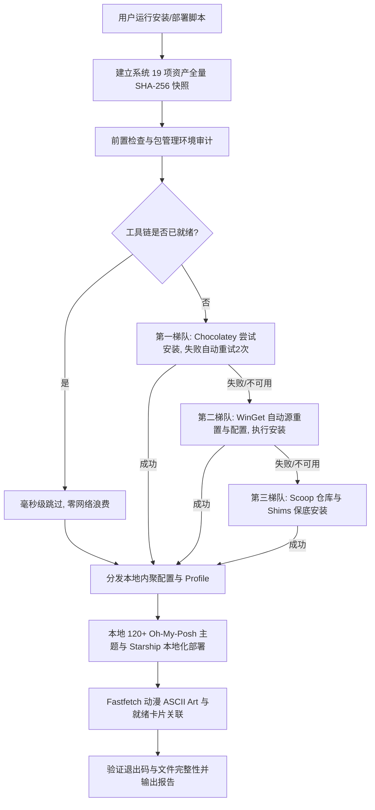

# Windows 全终端现代化与美化套件 —— 架构开发与部署全景指南

> 本文档面向系统管理员、开发者与终端发烧友，深入剖析本项目的系统架构设计、三级包管理容错降级机制、PowerShell 7 每次启动随机主题算法、全自动前置快照回退体系以及 Windows 平台编码避坑经验。

---

## 目录
1. [项目设计哲学与核心架构](#1-项目设计哲学与核心架构)
2. [全终端支持与配置资产拓扑](#2-全终端支持与配置资产拓扑)
3. [高稳定性包管理与环境准备机制 (容错审计)](#3-高稳定性包管理与环境准备机制-容错审计)
4. [PowerShell 7 终端美化与“每次启动随机主题”实现](#4-powershell-7-终端美化与每次启动随机主题实现)
5. [Fastfetch 动漫横幅与终端就绪卡片体系](#5-fastfetch-动漫横幅与终端就绪卡片体系)
6. [完整部署与安装实操指南](#6-完整部署与安装实操指南)
7. [救援备份与配置恢复机制](#7-救援备份与配置恢复机制)
8. [编码规范与 Windows 避坑经验 (CRITICAL)](#8-编码规范与-windows-避坑经验-critical)
9. [自动化验证与回归测试体系](#9-自动化验证与回归测试体系)
10. [常见问题排查与 FAQ](#10-常见问题排查与-faq)
11. [IDE 与编辑器集成方案 (VS Code / IntelliJ IDEA)](#11-ide-与编辑器集成方案-vs-code--intellij-idea)

---

## 1. 项目设计哲学与核心架构

在 Windows 环境下，终端美化与开发工具链常常面临以下几大痛点：
1. **安装成功率低与虚假成功**：依赖单一包管理器容易超时报错，或发生底层失败但上层仍盲目汇报成功的严重静默故障；
2. **缺乏状态保护与回退丢数据**：安装或回退时直接截断覆盖现有配置，不仅覆盖用户编辑，且无救援备份机制；
3. **冷启动严重阻塞**：Profile 中同步加载复杂外部工具（如 `vfox` 同步初始化单项耗时 9~11 秒），导致终端启动需 10 秒以上；
4. **不可信目录自动执行风险**：在不可信目录（如解压目录、未受信任的 git 仓库）启动 CMD 时，因命令查找优先命中当前工作目录，容易被同名程序劫持；
5. **编码兼容性与作用域灾难**：Windows PowerShell 5.1 默认代码页 936 (GBK) 易崩溃，NuShell 0.108+ 存在条件块别名作用域泄漏失效。

本项目秉承以下设计原则：
- **高可用与极高成功率 (High Availability & Fault Tolerance)**：自愈式三级包管理降级（Choco ➜ WinGet ➜ Scoop），全链路退出码检测与异常中断，就绪状态毫秒级跳过；
- **按需加载与可复测性能**：`vfox` 改为按需激活，`fif` 管道流式化，短路最小模式，受管外部进程有独立超时；Profile 主体耗时与完整冷启动分开统计；
- **救援快照与单文件原子替换**：19 个文件目标纳入清册，另存受管注册表值，回退前捕获 `pre-rollback` 副本，同目录临时文件 + `[IO.File]::Replace` 替换已有文件；
- **环境隔离与指针正交 (Disjoint Pointers & Sandbox)**：`.deployment-path`、`.last-install-backup` 与 `.last-cmd-backup` 完全解耦，快照纯数据化，严禁执行快照内脚本；
- **防 CWD 劫持安全加固 (CWD Execution Defense)**：CMD 启动强制绑定 `%SystemRoot%\System32`，动态注入点在安装期固化为可信绝对物理路径；
- **双解析器完全平权 (Dual-Engine Equivalence)**：一套源码同时在 `PowerShell 7 (Core)` 与 `Windows PowerShell 5.1 (Framework)` 下 100% 通过语法分析与行为验证。



---

## 2. 全终端支持与配置资产拓扑

本项目依托 [`scripts/TerminalState.ps1`](file:///c:/XMWJJ/powershelldome/scripts/TerminalState.ps1) 实现了对 Windows 体系内 5 大主流命令行运行时的完整美化与 19 项资产清册拓扑：

| 终端环境 | 运行进程 | 配置文件部署目标 | 核心美化/增强技术 | 纳入快照资产 |
| :--- | :--- | :--- | :--- | :--- |
| **PowerShell 7** | `pwsh.exe` | `~/Documents/PowerShell/Microsoft.PowerShell_profile.ps1` | Oh-My-Posh (120+主题) / Starship + PSReadLine + Terminal-Icons | `PowerShell7_profile.ps1` |
| **WinPS 5.1** | `powershell.exe` | `~/Documents/WindowsPowerShell/Microsoft.PowerShell_profile.ps1` | 专为 5.1 调优的极速 Starship + UTF-8 运行时修复 | `WinPS51_profile.ps1` |
| **CMD** | `cmd.exe` | `~/.config/cmd/autorun.cmd` + Clink Lua + 注册表 AutoRun | Clink Lua + Starship 渐变提示符 + 防 CWD 劫持 | `cmd_autorun.cmd`, `clink_starship.lua`, `clink_settings.lua`, AutoRun 注册表项 |
| **NuShell** | `nu.exe` | `~/AppData/Roaming/nushell/config.nu` + `env.nu` | Starship 结构化渲染 + Zoxide 快跳 + 顶层现代别名 | `nushell_config.nu`, `nushell_env.nu`, `nushell_starship.nu`, `nushell_zoxide.nu` |
| **MSYS2** | `bash.exe` | `<MsysRoot>/home/<User>/.bashrc` | Starship Linux 提示符 + PATH 继承 + 4类 ini 覆盖 | `msys2_bashrc`, `msys2.ini`, `ucrt64.ini`, `mingw64.ini`, `clang64.ini`, `MSYS2_PATH_TYPE` 环境变量 |
| **Windows Terminal** | `wt.exe` | `~/AppData/Local/Packages/.../LocalState/settings.json` | 亚克力磨砂透明、Catppuccin 配色、JetBrainsMono 字体 | `Terminal_stable.json`, `Terminal_preview.json` |
| **共享资产** | 全终端 | `~/.config/starship.toml` + `fastfetch/` | 赛博朋克提示符配置 + 动漫 ASCII 硬件仪表盘 | `starship.toml`, `fastfetch_config.jsonc`, `fastfetch_ascii.txt` |

---

## 3. 高稳定性包管理与环境准备机制 (容错审计)

针对用户提出的“**安装稳定成功率要高**”的核心诉求，项目在底层通用库 [`scripts/TerminalSetupCommon.ps1`](file:///c:/XMWJJ/powershelldome/scripts/TerminalSetupCommon.ps1) 中实施了严苛的稳态控制机制：

### 3.1 固定模块版本与来源
`Install-PSModulesIfMissing` 校验 PSGallery 的官方 URL，显式指定仓库和测试版本：PSReadLine 2.4.5、Terminal-Icons 0.11.0、PSFzf 2.7.3。安装后检查对应版本是否可发现；跨 PowerShell 版本安装通过目标引擎的子进程执行并检查退出码。保留用户原有仓库信任策略和发布者检查，不持久设置 PSGallery 为 Trusted。新环境仍需可用的 PowerShellGet/NuGet 提供程序。

### 3.2 智能包管理三级容错与失败阻断链 (Choco ➜ WinGet ➜ Scoop)
对于外部 CLI 软件（如 `starship`, `fastfetch`, `eza`, `bat`, `ripgrep`, `zoxide`, `yazi`）：
1. **就绪快速跳过 (Fast-Path Check)**：
   每次安装前优先执行 `Get-Command $tool -ErrorAction SilentlyContinue`，若已存在于 PATH 中，立刻返回成功，整体脚本耗时从数分钟降至秒级；
2. **第一梯队：Chocolatey 稳态安装与自动重试**：
   若检测到系统有 `choco`，执行安装，并捕获任何网络或锁文件错误。若失败，**内置指数回避机制并自动重试最多 2 次**；
3. **第二梯队：WinGet 自动修复与备用接管**：
   若 Choco 不可用或重试 2 次仍然失败，自动平滑切换到现代 Windows 标配的 WinGet。在执行安装前，自动运行：
   `winget source reset --force` 及 `winget source update`
   重置可能损坏或超时的本地源缓存，随后使用精确 `--id` 静默安装；
4. **第三梯队：Scoop 终极兜底 (跨版本保底)**：
   针对 Windows 8.1 等无法运行 WinGet 的遗留系统，自动调用 Scoop 软件源并配置相关 shims；
5. **严禁静默伪成功 (Fail-Fast Enforcement)**：
   严禁底层失败上层仍然 `return $true`。各层包管理器严格校验 `$process.ExitCode` 与命令可用性，全链路尝试失败后强制抛出终止异常 `throw "All installation methods failed for $Name."`，立即中断后续无效配置写入。

---

## 4. PowerShell 7 终端美化与启动性能

### 4.1 架构原理
以往终端美化要么固定单一主题，要么每次在线下载主题；或者在启动时同步调用重型工具（如旧版 `vfox activate` 单项耗时 9~11 秒），导致冷启动严重受阻。

本项目采用了**本地离线 120+ 官方全量主题库 + 每次启动随机抽取算法 + 外部进程超时托管 + 核心插件按需激活**的综合优化架构：
- 在安装阶段，`Ensure-OhMyPoshThemes` 会扫描本地 Scoop、WinGet、Program Files 及 `$env:POSH_THEMES_PATH`，将 120+ 官方精美主题同步至用户统一目录 `~/oh-my-posh-themes/`；
- 在用户 Profile 启动时，从本地主题库随机选择，整个过程耗时 **< 15ms**，零外部网络依赖；
- 对可能存在长等待的外部调用施加带强杀保护的进程管理器 `Invoke-ProfileProcess`（超时 1500ms 强制 Kill 并优雅降级）。

### 4.2 每次启动随机主题与异常降级
在 [`Microsoft.PowerShell_profile.ps1`](file:///c:/XMWJJ/powershelldome/Microsoft.PowerShell_profile.ps1) 中核心逻辑如下：

```powershell
# 纯内存确定性每次启动随机主题：零磁盘缓存写入，相同主题库在同一天必然选出同一主题
$randomThemes = @([IO.Directory]::GetFiles($themesDir, '*.omp.json') | Sort-Object)
if ($randomThemes.Count) {
    $profileThemeCandidates += Get-Random -InputObject $randomThemes
}

# 候选主题安全加载，内置 JSON 语法预检与保底回退
foreach ($candidate in @($profileThemeCandidates | Select-Object -Unique)) {
    if (-not [IO.File]::Exists($candidate)) { continue }
    try {
        # 预检 JSON 合法性，拒绝损坏的主题引发引擎崩溃
        $null = [IO.File]::ReadAllText($candidate) | ConvertFrom-Json -ErrorAction Stop
        $profileInit = Invoke-ProfileProcess oh-my-posh @('init', 'pwsh', '--config', $candidate)
        if (-not $profileInit) { continue }
        Invoke-Expression $profileInit
        break
    } catch { Write-Verbose "Oh My Posh: $_" }
}
```

### 4.3 自由切换主题模式
用户可以在任何时候通过环境变量或运行命令自由调整主题模式：
- **切换回固定经典主题**：`$env:POWERSHELL_THEME_MODE = 'fixed'`
- **切换回 Starship 赛博朋克极速主题**：`$env:POWERSHELL_THEME_MODE = 'starship'`
- **随时开启每次启动随机主题**：`$env:POWERSHELL_THEME_MODE = 'random'`

### 4.4 启动优化与测量范围
通过对审计报告中 12.56 秒启动瓶颈的深入根因治理，实施了四项核心性能举措：
1. **vfox 按需激活**：提供 `Enable-Vfox` 函数，默认不在 Profile 启动阶段同步执行 `vfox activate`，彻底消除 9~11 秒的最大延迟源；
2. **受管外部进程超时**：`Invoke-ProfileProcess` 为生成提示符和 Fastfetch 等调用提供独立时间预算。vfox 自动启动生成阶段为 3000ms，手动 `Enable-Vfox` 默认为 15000ms，可用 `-TimeoutMs` 调整至最多 60000ms；生成脚本中可静态识别的 vfox 清理、环境更新和退出调用通过 AST 改写为受管调用，每次 1500ms。模块导入和其它生成代码仍在当前进程执行，不承诺整个 Profile 有硬超时；
3. **极简模式短路**：非交互环境及 `POWERSHELL_PROFILE_MINIMAL=1` 跳过命令发现、提示符和模块导入；基础 PATH、编码设置及便利函数定义仍执行；
4. **fif 与大文件检索流式化**：
   - `fif <关键词>` 采用 `& rg @rgArgs -- $Query | & fzf @fzfArgs --no-multi` 管道流式传输，禁止空参数全量搜盘；
   - `Find-LargeFiles` 采用最大长度为 `$TopN` 的有界插入数组，杜绝全盘遍历结果在内存中全量堆积排序。

2026-09-07 复核版本 `c484a83` 的测量：Windows 11、PowerShell 7.6.5、正常用户权限、PTY 输入输出均未重定向、固定 Catppuccin Mocha 主题，每种模式 3 个新进程。这里记录修复前的复核数据，后续修改应运行同一脚本重新测量。

| 模式 | 最小值 | 中位数 | 最大值 |
| --- | ---: | ---: | ---: |
| defaults（vfox、图标、横幅、卡片关闭） | 3.012s | 3.142s | 4.121s |
| minimal | 0.385s | 0.417s | 0.566s |
| full（四个开关开启，vfox 三次超时降级） | 6.644s | 7.582s | 8.183s |

数据仅统计 Profile 主体，排除进程创建、首次提示符渲染和终端绘制，未控制磁盘冷缓存，不应称为完整冷启动。旧审计的默认模式开启了更多功能，full 又跳过了超时的 vfox，因此不能据此宣传同配置提速倍数。当前默认已开启图标、横幅和卡片，表中数据不代表当前默认性能。当前 `tests/Measure-ProfileStartup.ps1` 的 defaults 使用当前默认开关，不再复现旧表的关闭配置。历史证据见《审计修复复核-2026-09-07.md》。

---

## 5. Fastfetch 动漫横幅与终端就绪卡片体系

### 5.1 资产自包含与内聚设计
传统 Fastfetch 美化往往需要手动寻找字符画并将配置文件放置在复杂路径。本项目在仓库根目录直接内置了完整生产力资产：
- [`fastfetch/ascii.txt`](file:///c:/XMWJJ/powershelldome/fastfetch/ascii.txt)：精制二次元/动漫高密度点阵字符画；
- [`fastfetch/config.jsonc`](file:///c:/XMWJJ/powershelldome/fastfetch/config.jsonc)：基于 Catppuccin Mocha 配色方案的硬件与软件状态采集器。

### 5.2 绝对路径自动化适配与跨终端复用
在执行任何终端安装脚本时，底层库会自动检测并将横幅与配置复制到 `%USERPROFILE%/.config/fastfetch/`，并将 `config.jsonc` 内部的 ASCII 图标路径动态替换为本机的物理绝对路径（采用标准正斜杠 `/` 规避 JSON 转义错误）。

### 5.3 终端功能就绪卡片（真实加载检测与双列紧凑仪表盘）
当新开任何一个美化后的终端时，控制台不仅展示硬件与操作系统信息，还会通过后台真实状态探测，输出**双列对齐紧凑仪表盘**：
- **严格真实检测**：逐项检测命令可执行性、模块导入与按键绑定，成功显示绿色 `✓`；
- **异常明确告警**：若某个外部工具未安装或功能降级，自动在告警栏清晰标黄输出 `✗ <功能> 未就绪: 缺少 <工具名>, 建议运行: scoop install <工具名>`，绝不虚假显示成功；
- **自适应宽度**：终端宽度小于 82 列时自动切换为单列紧凑流，避免边框换行错位；
- **快捷键速查条**：底部附带常用高频快捷键速查。

```text
╭── 🚀 终端现代化生产力就绪看板 ──────────────────────────────────────
│  ✓ yazi 目录穿梭 (y [path])              ✓ fd 极速索引引擎 (FZF加速)
│  ✓ bat+eza 画中画实时预览 (智能高亮)     ✓ fzf 模糊搜索 (Ctrl+R/F/Alt+Z)
│  ✓ eza 现代文件列表 (ll/la/lt/llg)       ✓ lazydocker 容器管家 (lzd)
│  ✓ Neovim 默认编辑器 (v/fv)              ✓ zoxide 智能目录快跳 (z/zi)
│  ✓ fif 全文代码检索 (fif <词>)           ✓ fastfetch 动漫硬件看板 (系统状态)
│  ✓ lazygit Git管家 (lg/Ctrl+G)           ✓ starship 赛博提示符 (已就绪)
│
│  ⚡ 快捷按键: [Ctrl+R] 历史搜 · [Alt+Z/zi] 目录跳 · [Ctrl+F] 文件填
│  ⚡ 效率指令: [lg/Ctrl+G] Lazygit · [fv] 模糊编辑 · [fif] 全文搜
╰─────────────────────────────────────────────────────────────────────
```

### 5.4 生产力增强指令集 (A+B 方案)
- **`lg` / `lzg` / `[Ctrl+G]` (Lazygit)**：极速终端全屏交互式 Git 客户端（支持键盘快捷键 `Ctrl+G` 一键呼出，退出自动重载提示符）；
- **`lzd` / `lazydocker`**：终端全屏交互式 Docker 容器与镜像看板；
- **`fv` (Fuzzy View & Edit)**：交互式模糊查找当前目录文件（右侧以 `bat` 实时语法高亮预览），回车直接使用 Neovim 打开；
- **`fif <关键词>` (Find In Files)**：联动 `ripgrep` + `fzf` + `bat` + `nvim`，实现毫秒级全文秒搜，回车光标直达 Neovim 目标代码行；
- **`v <文件/目录>`**：单字母极速呼出 Neovim；
- **`lt` / `lt3`**：调用 `eza` 分别以 2 层和 3 层树状图展示当前目录；
- **`llg`**：调用 `eza --long --git`，文件列表直接显示 Git 变更与暂存状态；
- **`..` / `...` / `....`**：极速上溯父级目录；
- **FZF 画中画预览**：集成 Catppuccin Mocha 终端配色、圆角边框、文件实时代码高亮与目录树动态预览。

---

## 6. 完整部署与安装实操指南

### 6.1 全新机器/重装系统一键总装（推荐）
在具备管理员权限或普通用户权限的 PowerShell 中执行：
```powershell
# 1. 克隆代码仓库
git clone https://github.com/vicky-clair/configuration_of_Terminal_and_PowerShell_for_Xia_Rui.git
cd configuration_of_Terminal_and_PowerShell_for_Xia_Rui

# 2. 一键总装 5 大全套终端环境（PS7 + WinPS 5.1 + CMD + NuShell + MSYS2）
pwsh -File .\Install-All.ps1 -All
# 若系统中尚未安装 PowerShell 7，可先用 Windows 原生 PowerShell 执行：
powershell.exe -ExecutionPolicy Bypass -File .\Install-All.ps1 -All
```

### 6.2 独立终端按需安装与定制
| 目标终端 | 安装命令 | 默认特性与配置项 |
| :--- | :--- | :--- |
| **PowerShell 7** | `pwsh -File .\Install-PowerShell7.ps1` | **默认配置每次启动随机主题**，亦可自由选择固定主题或 Starship |
| **WinPS 5.1** | `powershell.exe -ExecutionPolicy Bypass -File .\Install-WinPowerShell51.ps1` | 默认配置随机丰富主题（可选 -Theme Starship），永久修复 UTF-8 代码页 |
| **CMD** | `pwsh -File .\Install-Cmd.ps1` | 安装 Clink、Starship、注册表自动挂载 |
| **NuShell** | `pwsh -File .\Install-NuShell.ps1` | 结构化脚本配置、UTF-8 中文环境、Starship 集成 |
| **MSYS2** | `pwsh -File .\Install-MSYS2.ps1` | 自动配置环境继承、原生工具互通、Bash 提示符 |

---

## 7. 救援备份与配置恢复机制

### 7.1 全量 19 项目标清册与版本 2 清单结构 (`manifest.json`)
在对终端配置进行任何实质写入前，底层调度库 [`scripts/TerminalState.ps1`](file:///c:/XMWJJ/powershelldome/scripts/TerminalState.ps1) 会扫描系统中所有 19 项受管目标（涵盖配置文件、用户级环境变量与注册表项）：
- 目标路径动态解析，调用 `Get-TerminalDocumentsPath` 支持真实用户目录重定向（如企业 OneDrive 文件夹重定向环境）；
- 对每个目标计算纯 .NET SHA-256 校验和，生成版本 2 格式的快照清单 `manifest.json`。

清单文件样例如下：
```json
{
  "Version": 2,
  "Timestamp": "2026-09-07T12:44:30.1234567+08:00",
  "Files": [
    {
      "Name": "PowerShell7_profile.ps1",
      "Target": "C:\\Users\\User\\Documents\\PowerShell\\Microsoft.PowerShell_profile.ps1",
      "Desc": "PowerShell 7 Profile",
      "Existed": true,
      "SHA256": "4A1B2C..."
    },
    {
      "Name": "nushell_zoxide.nu",
      "Target": "C:\\Users\\User\\AppData\\Roaming\\nushell\\vendor\\autoload\\zoxide.nu",
      "Desc": "NuShell",
      "Existed": false,
      "SHA256": ""
    }
  ],
  "Registry": [
    {
      "Key": "HKCU:\\Software\\Microsoft\\Command Processor",
      "Name": "AutoRun",
      "Existed": true,
      "Kind": "String",
      "Value": "if exist \"%USERPROFILE%\\.config\\cmd\\autorun.cmd\" ..."
    }
  ]
}
```

### 7.2 两阶段救援快照 (`pre-rollback`) 与单文件替换
执行回退（`Restore-All.ps1` 或 `Restore-TerminalConfiguration.ps1`）时，严格遵循以下防数据丢失安全工作流：
1. **预检与目标白名单过滤**：
   只允许恢复受管清册以内的目标路径，拒绝快照篡改或非法跨目录路径；强制校验源快照文件哈希；
2. **两阶段救援副本捕获 (`pre-rollback-<guid>`)**：
   在真正开始覆写或清理磁盘前，脚本首先将当前磁盘上的**最新实时文件内容与注册表状态**完整抓取，存放在快照目录下的 `pre-rollback-<guid>/`，并写入状态日志 `restore-status.json`（标记为 `Applying`）；
3. **并发修改与一致性预检**：
   若救援捕获之后目标文件被外部进程并发篡改，SHA-256 不一致立刻抛出异常中断回退；
4. **同卷临时文件原子替换 (`Set-TerminalBytes`)**：
   在目标文件同级目录生成临时文件，写入、刷盘后调用 `[IO.File]::Replace` 替换已有文件，避免直接截断目标；新文件使用同目录 Move。此保证限于单文件替换，不是跨卷原子写入；
5. **状态记录**：本次选中的文件及注册表处理完成后，日志更新为 `Completed`；捕获到失败则记录 `Failed` 并报告救援目录。中断后日志也可能停留在 `Applying`。

整个恢复不是多文件、注册表事务，异常前可能已有部分目标恢复。救援目录为人工恢复提供捕获时的副本，不保证断电、磁盘损坏或全部并发修改场景下绝对无损。

### 7.3 快照指针正交隔离（杜绝快照错选）
- **`.deployment-path`**：由 `Deploy-TerminalConfiguration.ps1` 专属维护，记录生产同步快照；`Restore-TerminalConfiguration.ps1` 仅从此指针回滚，绝不串扰安装状态；
- **`.last-install-backup`**：由各终端独立安装脚本与 `Install-All.ps1` 维护，记录完整系统安装前快照；
- **`.last-install-context.json`**：在快照目录之外记录本次安装的 MSYS2 实际根目录，与 `.last-install-backup` 严格绑定；默认回退可以使用，显式选择历史或外部快照时仍须提供 `-Msys2InstallPath`，不从备份内容放宽白名单；
- **`.last-cmd-backup`**：由 `cmd/Install-CmdConfiguration.ps1` 维护，卸载 CMD 时精准恢复前序 AutoRun 字符串与文件。

### 7.4 快照纯数据化安全原则
快照目录只存放备份镜像与元数据 `manifest.json`，**彻底移除执行快照内脚本的危险逻辑**。回退调用统一使用仓库根目录下受版本控制的可信脚本。

---

## 8. 编码规范与 Windows 避坑经验 (CRITICAL)

在跨 PowerShell 7、Windows PowerShell 5.1、CMD 与 NuShell 开发时，必须遵守以下核心规约：

### 8.1 UTF-8 with BOM 规则 (PowerShell 脚本铁律)
- **现象**：在 Windows PowerShell 5.1（代码页 936 / GBK）环境下，若 `.ps1` 文件保存为普通无 BOM 的 UTF-8，当脚本中包含任何汉字注释或字符串时，解析器会把双引号吞噬，触发致命语法错误：`ParseException: 表达式或语句中包含意外的标记`。
- **规约**：本项目**除备份只读快照外，所有的 `.ps1` 脚本文件一律强制使用 UTF-8 with BOM (`EF BB BF`) 存储**。

### 8.2 UTF-8 without BOM 规则 (现代 CLI 工具铁律)
- **NuShell (`.nu`)**：NuShell 语法解析器不允许首字符出现 BOM 字节，否则报错：`Command '#' not found`；
- **Fastfetch (`config.jsonc`)**：官方 JSONC 解析器严格遵循 JSON 标准，若存在 BOM 会报错：`UTF-8 byte order mark (BOM) is not supported`；
- **规约**：项目中的 `fastfetch/*.jsonc` 和 `nushell/*.nu` 配置文件**一律严禁包含 BOM**。

### 8.3 批处理换行符规则 (CMD autorun.cmd)
- `cmd/autorun.cmd` 必须使用标准 Windows 回车换行符 **CRLF (`\r\n`)**，避免在老版本 `cmd.exe` 批量解析批处理标签时发生语法截断。

### 8.4 CMD 工作目录程序查找劫持防范 (CWD Execution Hazard)
- **现象**：Windows `cmd.exe` 在执行未带路径的指令（如 `fastfetch`, `starship`）时，**默认先检索当前工作目录，再检索 PATH 环境变量**。在不可信目录下运行 CMD 将直接触发同名恶意程序执行。
- **规约**：
  - 系统内置工具强制使用绝对路径：`"%SystemRoot%\System32\chcp.com"` 与 `"%SystemRoot%\System32\doskey.exe"`；
  - 动态工具（Clink, Fastfetch）在安装阶段通过受信任根目录（`Program Files`, `Scoop` 等）解析为绝对路径后写入启动脚本；
  - 启动脚本首行判断 `CMDCMDLINE`，遇到 `/c` 等批处理参数立即跳过，避免非交互命令调用启动脚本开销。

### 8.5 NuShell 0.108+ 词法作用域别名规约
- **现象**：在 NuShell 0.108.0 及以上版本中，在 `if` 或作用域块内部定义的 `alias`，跳出块级后会被作用域垃圾回收，导致外层会话别名丢失。
- **规约**：所有别名（如 `alias ll = ...`）必须置于配置文件顶层作用域声明。

### 8.6 PowerShell Copy-Item -LiteralPath 通配符不展开规约
- **现象**：`Copy-Item -LiteralPath "$cand\*.omp.*"` 会将星号作为普通字符对待，从而无法匹配任何文件并静默返回。
- **规约**：批量文件复制必须先用 `Get-ChildItem -File -Filter '*.omp.json'` 获取真实 FileInfo 对象，再逐一复制。

---

## 9. 自动化验证与回归测试体系

项目配备 4 套自动化验证套件及 1 套性能测量工具，可在 `PowerShell 7` 与 `Windows PowerShell 5.1` 下运行。2026-09-07 本轮修复后 8 次回归执行均通过；测试以隔离配置和安装、注册表替身为主，覆盖范围不包括真实联网安装、所有 Windows 版本或断电实验：

### 9.1 静态语法与配置自检 (`tests/Verify-Configuration.ps1`)
```powershell
pwsh -NoProfile -ExecutionPolicy Bypass -File .\tests\Verify-Configuration.ps1
powershell.exe -NoProfile -ExecutionPolicy Bypass -File .\tests\Verify-Configuration.ps1
```
覆盖项：Windows Terminal JSON 结构有效性、所有脚本 AST 抽象语法树 0 报错、Profile 重复载入安全性、极简模式静默启动与 Git 参数前向透传。

### 9.2 沙箱隔离部署与回退回归测试 (`tests/Verify-Deployment.ps1`)
```powershell
pwsh -NoProfile -ExecutionPolicy Bypass -File .\tests\Verify-Deployment.ps1
powershell.exe -NoProfile -ExecutionPolicy Bypass -File .\tests\Verify-Deployment.ps1
```
覆盖项：沙箱虚拟环境中的原子部署、SHA-256 镜像一致性、`-WhatIf` 只读安全性、文件并发修改保护及部署专用回退。

### 9.3 救援快照、原子写入与防提权劫持专项安全测试 (`tests/Verify-Safety.ps1`)
```powershell
pwsh -NoProfile -ExecutionPolicy Bypass -File .\tests\Verify-Safety.ps1
powershell.exe -NoProfile -ExecutionPolicy Bypass -File .\tests\Verify-Safety.ps1
```
覆盖项：
- 19 项全量资产清册验证（含 `zoxide.nu`、MSYS2 ini 及注册表类型）；
- 回退前 `pre-rollback` 救援快照创建与数据可恢复性断言；
- 恶意修改快照清单 Target 的白名单拦截；
- 目标文件被只读锁定时原子替换的 Fail-Safe 安全保护；
- 包管理器模拟失败时退出码的强制中断；
- 外部进程超时中断保护。

### 9.4 真实安装模板渲染、NuShell 作用域与 CMD 劫持防御测试 (`tests/Verify-GeneratedConfiguration.ps1`)
```powershell
pwsh -NoProfile -ExecutionPolicy Bypass -File .\tests\Verify-GeneratedConfiguration.ps1
powershell.exe -NoProfile -ExecutionPolicy Bypass -File .\tests\Verify-GeneratedConfiguration.ps1
```
覆盖项：
- 真实安装器模板生成的 PowerShell 7 / 5.1 Profile 语法与执行静默性；
- NuShell 0.108+ 真实进程内 4 个别名可见性断言；
- CMD 在模拟恶意工作目录下的防劫持断言；
- CMD 卸载时还原前序 AutoRun 原值断言。

### 9.5 安装器真实路径、MSYS2/NuShell 终端注册与异常测试 (`tests/Verify-InstallerIntegration.ps1`)
```powershell
pwsh -NoProfile -ExecutionPolicy Bypass -File .\tests\Verify-InstallerIntegration.ps1
powershell.exe -NoProfile -ExecutionPolicy Bypass -File .\tests\Verify-InstallerIntegration.ps1
```
覆盖项：
- 包管理器在不同安装路径（如 Scoop 用户目录及自定义 `-Msys2InstallPath`）下真实二进制判定，杜绝固定路径误判失败；
- Windows Terminal 配置注入：精准使用可执行文件及 GUID 匹配识别，杜绝 `*nu*` 误匹配（如 GNU Bash）；
- 自定义 MSYS2 根路径与 Terminal 启动入口联动，同步更新旧入口；
- MSYS2 生成的 `.bashrc` 中集成 `eval "$(zoxide init bash)"` 目录快跳；
- Terminal 配置解析或写入异常强制抛出，避免将异常吞为 Verbose 导致误报成功。

### 9.6 交互式 Profile 启动耗时基准测量 (`tests/Measure-ProfileStartup.ps1`)
```powershell
pwsh -NoProfile -ExecutionPolicy Bypass -File .\tests\Measure-ProfileStartup.ps1 -Mode defaults
pwsh -NoProfile -ExecutionPolicy Bypass -File .\tests\Measure-ProfileStartup.ps1 -Mode minimal
pwsh -NoProfile -ExecutionPolicy Bypass -File .\tests\Measure-ProfileStartup.ps1 -Mode full
```

---

## 10. 常见问题排查与 FAQ

### Q1: 启动 PowerShell 提示“因为在此系统上禁止运行脚本...”？
**解答**：Windows 默认执行策略限制。只需在当前用户作用域内放行即可（无需全局管理员）：
```powershell
Set-ExecutionPolicy -Scope CurrentUser -ExecutionPolicy RemoteSigned -Force
```

### Q2: 图标显示为乱码方块或问号？
**解答**：这是由于当前控制台未启用 Nerd Font 图标字体。
1. 请下载并安装 [JetBrainsMono Nerd Font](https://www.nerdfonts.com/font-downloads)；
2. 在 Windows Terminal 设置中，进入对应 Profile ➜ 外观 ➜ 字体，选择 `JetBrainsMono Nerd Font` 即可完美呈现全部图标。

### Q3: 为什么今日随机抽到的主题我想固定下来？
**解答**：若您喜欢某天抽到的主题（例如 `amro` 或 `tokyonight_storm`）：
1. 记下控制台顶部打印的主题名称；
2. 运行 `pwsh -File .\Install-PowerShell7.ps1`，输入 `1` 选择固定主题并填入该名称；或者直接在 `$PROFILE` 中将主题路径指定为该文件即可。

### Q4: 怎样完全卸载所有终端美化并恢复原状？
**解答**：直接运行本项目根目录下的回退脚本：
```powershell
pwsh -File .\Restore-All.ps1
```
脚本将基于部署前的 SHA-256 快照，一键将注册表、Profile、Windows Terminal 设置全量精确复原。

---

## 11. IDE 与编辑器集成方案 (VS Code / IntelliJ IDEA)

本项目所配置的终端不仅能在独立 Windows Terminal 窗口中运行，更专为现代开发者的主力 IDE（VS Code、IntelliJ IDEA、PyCharm、WebStorm 等）进行了专项适配。

### 11.1 核心配置原则
- **独立字体配置**：IDE 内置终端必须明确选择带有 `Nerd Font`、`NF` 或 `NFP` 后缀的字体（如 `JetBrainsMono NFP`），不可直接继承普通编辑器的代码字体；
- **编码强制 UTF-8**：在终端启动时确保代码页为 `65001`，彻底杜绝 Maven、Gradle、Git 提交记录中的中文乱码；
- **极简横幅适配**：若 IDE 底部终端窗口高度较小，可通过在 IDE 环境变量中设置 `POWERSHELL_PROFILE_BANNER=0` 隐藏大型 Fastfetch 字符画，实现极简秒开。

详细的一键 JSON 配置、多 Shell Profile 配置与图形界面操作步骤，请参阅：
👉 **[IDE 与开发工具集成指南 (IDE与开发工具集成指南.md)](IDE与开发工具集成指南.md)**。
